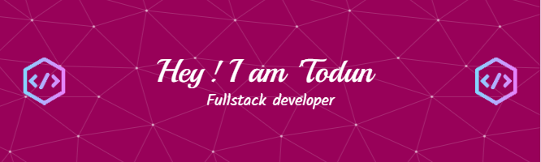

<!--
**toduno/toduno** is a ✨ _special_ ✨ repository because its `README.md` (this file) appears on your GitHub profile.
-->

<!-- 

  

 -->

<h1 align="left">Hi 👋, I'm 'Todun</h1>
<h2 align="left">A Software Engineer and Cloud Enthusiast</h2>

<h3 align='left'>About Me:</h3>

I'm a fullstack developer delving into developers operations one command at a time. I'm passionate about <em>immersive user interfaces</em>, <em>development</em> and <em>operations</em>, and actively looking for opportunities in these fields, and to collaborate on cool open-source projects. Currently learning cloud technologies and tools like <b>AWS</b> and <b>Terraform</b>, while also working on MERN stack projects.

In my spare time, I play games, watch comedy and practice self-care.

<h3 align="left">Languages and Tools I Use:</h3>

                 

<!-- # <h3 align="left">📊My GitHub Stats: </h3>  
 
 
 -->

<!-- ## <h3>🏆My GitHub Trophies</h3>
 -->

### <h3>Random Dev Quote:</h3>

<h3 align="left">Connect With Me:</h3>

   
  

<!--START_SECTION:activity-->
---
<!--  -->

